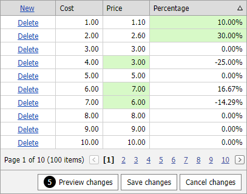

<!-- default badges list -->

[](https://supportcenter.devexpress.com/ticket/details/T558750)
[](https://docs.devexpress.com/GeneralInformation/403183)
<!-- default badges end -->

# GridView for Web Forms - How to change a cell value based on another cell value in batch edit mode

This example demonstrates how to change a column value (Price) when another column (Percentage) is changed and vice versa.



The [ASPxClientGridView](https://docs.devexpress.com/AspNet/js-ASPxClientGridView) class implements the [batchEditApi](https://docs.devexpress.com/AspNet/js-ASPxClientGridView.batchEditApi) property that exposes an API to work with the grid in batch mode on the client side.

After a user edits the value, the [BatchEditEndEditing](https://docs.devexpress.com/AspNet/js-ASPxClientGridView.BatchEditEndEditing) event is raised. In the event handler, you can get a cell value in the following ways:

- The [batchEditApi.GetCellValue](https://docs.devexpress.com/AspNet/js-ASPxClientGridViewBatchEditApi.GetCellValue(visibleIndex-columnFieldNameOrId)) method returns the value of the specified cell that is not in **edit mode**.
- The [rowValues](https://docs.devexpress.com/AspNet/js-ASPxClientGridViewBatchEditEndEditingEventArgs.rowValues) property returns the new value of the specified cell that is in **edit mode**.

The [batchEditApi.SetCellValue](https://docs.devexpress.com/AspNet/js-ASPxClientGridViewBatchEditApi.SetCellValue(visibleIndex-columnFieldNameOrId-value)) method allows you to specify a cell value.

```js
function OnBatchEditEndEditing(s, e) {
    var cPrice = s.GetColumnByField("Price");
    var cPercentage = s.GetColumnByField("Percentage");
    var cost = s.batchEditApi.GetCellValue(e.visibleIndex, "Cost");
    if (fieldName == "Price") {
        var price = e.rowValues[cPrice.index].value;
        s.batchEditApi.SetCellValue(e.visibleIndex, "Percentage", (price - cost) / (cost), null, true);
    }
    if (fieldName == "Percentage") {
        var percentage = e.rowValues[cPercentage.index].value;
        s.batchEditApi.SetCellValue(e.visibleIndex, "Price", cost + (cost * percentage), null, true);
    }
}
```

## Files to Look At

<!-- default file list -->
- [Default.aspx](./CS/Default.aspx) (VB: [Default.aspx](./VB/Default.aspx))
- [Default.aspx.cs](./CS/Default.aspx.cs) (VB: [Default.aspx.vb](./VB/Default.aspx.vb))
<!-- default file list end -->

## Documentation

- [Batch Edit Mode](https://docs.devexpress.com/AspNet/16443/components/grid-view/concepts/edit-data/batch-edit-mode)
